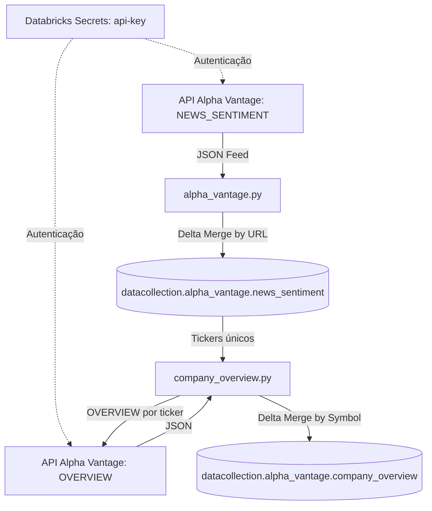

# Data Collection Pipeline — Alpha Vantage

Este repositório contém um pipeline de ingestão de dados desenvolvido no **Databricks** usando **Databricks Asset Bundles (DAB)**, **PySpark**, **Delta Lake** e **GitHub Actions**. O pipeline coleta notícias com sentimento de mercado e dados fundamentalistas de empresas a partir da API **Alpha Vantage**, processa os dados estruturadamente e realiza *upserts* incrementais no **Unity Catalog**.

---

## 🏗️ Arquitetura e Fluxo de Dados



### Tasks do pipeline (executadas em sequência)

| Ordem | Task | Script | Chave de Upsert |
|-------|------|--------|-----------------|
| 1 | `ingestao_alpha_vantage` | `src/alpha_vantage.py` | `url` |
| 2 | `ingestao_company_overview` | `src/company_overview.py` | `Symbol` |

1. **News Sentiment**: consome `NEWS_SENTIMENT` filtrando notícias de ontem (UTC) sobre `manufacturing` e `technology`, estrutura o JSON em DataFrame PySpark e persiste via Delta MERGE em `news_sentiment`.
2. **Company Overview**: lê os tickers únicos de `news_sentiment` (excluindo `FOREX:*`, `CRYPTO:*` etc.), chama `OVERVIEW` para cada ticker e persiste dados fundamentalistas via Delta MERGE em `company_overview`.

---

## 📂 Estrutura do Projeto

```text
├── .github/
│   └── workflows/
│       └── deploy.yml                          # Pipeline de CI/CD (GitHub Actions)
├── docs/
│   ├── data_dictionary_news_sentiment.md       # Dicionário de dados de news_sentiment
│   └── data_dictionary_company_overview.md     # Dicionário de dados de company_overview
├── src/
│   ├── alpha_vantage.py                        # Task 1: ingestão de notícias com sentimento
│   └── company_overview.py                     # Task 2: dados fundamentalistas por ticker
├── notebooks/
│   ├── exploration_news_sentiment.ipynb        # EDA de news_sentiment
│   └── exploration_company_overview.ipynb      # EDA de company_overview
├── databricks.yml                              # Configuração do Databricks Asset Bundle (IaC)
├── pyproject.toml                      # Configuração do projeto e dependências (uv)
├── uv.lock                             # Lockfile de dependências gerado pelo uv
└── .env                                # Variáveis de ambiente locais (não versionado)
```

---

## ⚙️ Configuração e Pré-requisitos

### 1. Requisitos Locais
```bash
uv sync
```

Crie um arquivo `.env` na raiz com a chave da API:
```
ALPHA_VANTAGE_API_KEY=sua_chave_aqui
```

### 2. Configurar Segredos no Databricks
```bash
# Criar o escopo de segredos
databricks secrets create-scope alpha-vantage

# Adicionar a API Key
databricks secrets put-secret alpha-vantage api-key
```

### 3. Unity Catalog

O pipeline cria automaticamente o schema se não existir. As tabelas produzidas são:

| Tabela | Descrição | Chave |
|--------|-----------|-------|
| `datacollection.alpha_vantage.news_sentiment` | Artigos de notícias com sentimento por ticker — [dicionário de dados](docs/data_dictionary_news_sentiment.md) | `url` |
| `datacollection.alpha_vantage.company_overview` | Dados fundamentalistas por empresa — [dicionário de dados](docs/data_dictionary_company_overview.md) | `Symbol` |

---

## 🚀 Deploy e CI/CD

### Deploy Automático (Recomendado)
Qualquer merge na branch `main` dispara o workflow do GitHub Actions:
1. **Validação**: `databricks bundle validate`
2. **Deploy**: `databricks bundle deploy`

Configure os segredos `DATABRICKS_HOST` e `DATABRICKS_TOKEN` nas configurações do repositório no GitHub.

### Deploy Manual (Local)
```bash
databricks bundle validate --target default
databricks bundle deploy --target default
```

---

## ⏱️ Agendamento

* **Frequência**: diariamente às **08:00** (America/Sao_Paulo)
* **Expressão Cron**: `0 0 8 * * ?`
* **Notificações**: e-mail em caso de sucesso ou falha para `thiago2608santana@gmail.com`

---

## 📓 Notebooks de Análise

| Notebook | Tabela base | Conteúdo |
|----------|-------------|----------|
| `notebooks/exploration_news_sentiment.ipynb` | `news_sentiment` | Volume temporal, qualidade dos dados, distribuição de sentimento, fontes/autores, séries temporais (decomposição, anomalias), análise de tickers e análise de tópicos |
| `notebooks/exploration_company_overview.ipynb` | `company_overview` | Top 10 empresas por capitalização de mercado |

### `exploration_news_sentiment.ipynb` — seções

| Seção | Descrição |
|-------|-----------|
| 2.1 Volume temporal | Artigos por dia, detecção de gaps de ingestão |
| 2.2 Qualidade dos dados | Nulos por coluna, distribuição do tamanho dos arrays `topics` e `ticker_sentiment` |
| 2.3 Sentimento | Distribuição de `overall_sentiment_label` e histograma do score contínuo |
| 2.4 Fontes e autores | Top fontes, domínios e autores por volume |
| 3.1–3.4 Séries temporais | Sentimento diário, sazonalidade (dia/hora), anomalias por z-score, decomposição aditiva e volatilidade rolling |
| Tickers | Explode de `ticker_sentiment`, ranking por sentimento médio (filtro `relevance_score ≥ 0.5`) |
| 4.1–4.4 Tópicos | Explode de `topics`, top tópicos por frequência, distribuição de relevância (boxplot), sentimento médio por tópico, evolução temporal |

---

## ⚠️ Limites da API (plano gratuito)

* 25 requisições/dia · ~75 requisições/minuto
* `company_overview.py` aplica 1 segundo de pausa entre chamadas
* Se o número de tickers únicos ultrapassar 25, as requisições excedentes são silenciosamente ignoradas pela API — considere um upgrade de plano conforme o volume crescer
