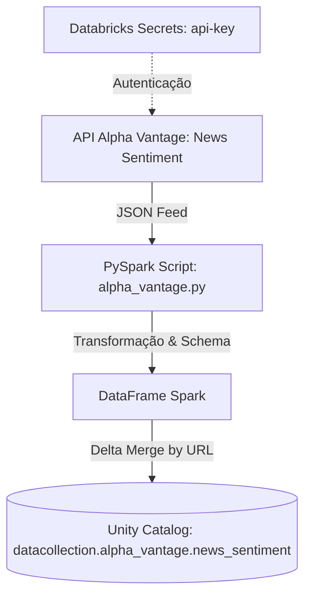

# Data Collection Pipeline — Alpha Vantage News Sentiment

Este repositório contém um pipeline de ingestão de dados desenvolvido no **Databricks** usando **Databricks Asset Bundles (DAB)**, **PySpark**, **Delta Lake** e **GitHub Actions**. O pipeline coleta notícias e dados de sentimento da API **Alpha Vantage**, processa os dados estruturadamente e realiza um *upsert* incremental no **Unity Catalog**.

---

## 🏗️ Arquitetura e Fluxo de Dados



1. **Ingestão**: O script `src/alpha_vantage.py` consome a API Alpha Vantage filtrando por notícias de ontem (UTC) sobre os tópicos de `manufacturing` (indústria) e `technology` (tecnologia).
2. **Autenticação**: A chave da API é recuperada de forma segura através do recurso **Databricks Secrets**.
3. **Transformação**: Os dados JSON são estruturados em um DataFrame PySpark utilizando um schema fortemente tipado (`StructType`). O campo `time_published` é convertido para timestamp e é adicionada uma coluna de auditoria `ingestion_ts`.
4. **Armazenamento**: É realizado um *upsert* (MERGE) usando Delta Lake. Artigos já existentes (identificados pela URL única) são atualizados em caso de alterações, e novos artigos são inseridos, evitando duplicidade de dados no Unity Catalog.

---

## 📂 Estrutura do Projeto

```text
├── .github/
│   └── workflows/
│       └── deploy.yml                  # Pipeline de CI/CD (GitHub Actions)
├── src/
│   └── alpha_vantage.py                # Código-fonte principal do script PySpark
├── exploration_alpha_vantage.ipynb     # Notebook usado para análise exploratória de dados
├── databricks.yml                      # Configuração do Databricks Asset Bundle (IaC)
├── requirements.txt                    # Dependências Python para desenvolvimento local/IDE
└── .env                                # Variáveis de ambiente locais (não versionado)
```

---

## ⚙️ Configuração e Pré-requisitos

### 1. Requisitos Locais
Para configurar seu ambiente de desenvolvimento local, instale as dependências listadas no [requirements.txt](file:///Users/thiagosantana/data-collection/requirements.txt):
```bash
pip install -r requirements.txt
```

### 2. Configurar Segredos no Databricks
Para que o pipeline execute com sucesso no Databricks, você deve configurar o escopo de segredos e adicionar a chave de API da Alpha Vantage:

```bash
# 1. Criar o escopo de segredos
databricks secrets create-scope alpha-vantage

# 2. Adicionar o segredo (insira a API Key da Alpha Vantage quando solicitado)
databricks secrets put-secret alpha-vantage api-key
```

### 3. Unity Catalog
O pipeline cria automaticamente o catálogo e o schema necessários se eles não existirem:
* **Catálogo**: `datacollection`
* **Schema**: `alpha_vantage`
* **Tabela Delta**: `news_sentiment`

---

## 🚀 Deploy e CI/CD

O deploy da infraestrutura e dos jobs no Databricks é totalmente automatizado usando **Databricks Asset Bundles (DAB)** e **GitHub Actions**.

### Deploy Automático (Recomendado)
Qualquer alteração mesclada (*merged*) na branch `main` disparará o workflow no GitHub Actions ([deploy.yml](file:///Users/thiagosantana/data-collection/.github/workflows/deploy.yml)):
1. **Validação**: Executa `databricks bundle validate` para garantir que a configuração está correta.
2. **Deploy**: Executa `databricks bundle deploy` para atualizar os jobs e tarefas no workspace alvo.

*Nota: Certifique-se de configurar os segredos `DATABRICKS_HOST` e `DATABRICKS_TOKEN` nas configurações do seu repositório do GitHub.*

### Deploy Manual (Local)
Caso queira realizar o deploy localmente usando a CLI do Databricks:
```bash
# Validar as configurações do bundle
databricks bundle validate --target default

# Executar o deploy no workspace
databricks bundle deploy --target default
```

---

## ⏱️ Agendamento (Schedule)

O pipeline está configurado na Databricks Asset Bundle ([databricks.yml](file:///Users/thiagosantana/data-collection/databricks.yml)) para rodar de forma agendada:
* **Frequência**: Diariamente às **08:00** (Horário de Brasília / `America/Sao_Paulo`).
* **Expressão Cron**: `0 0 8 * * ?`
* **Notificações**: Em caso de sucesso ou falha, e-mails de alerta são enviados para `thiago2608santana@gmail.com`.
